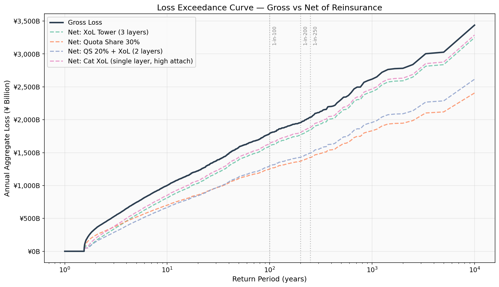
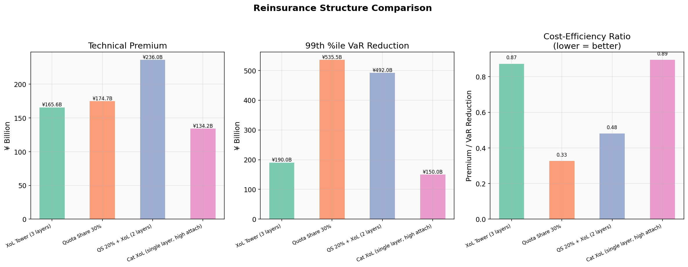
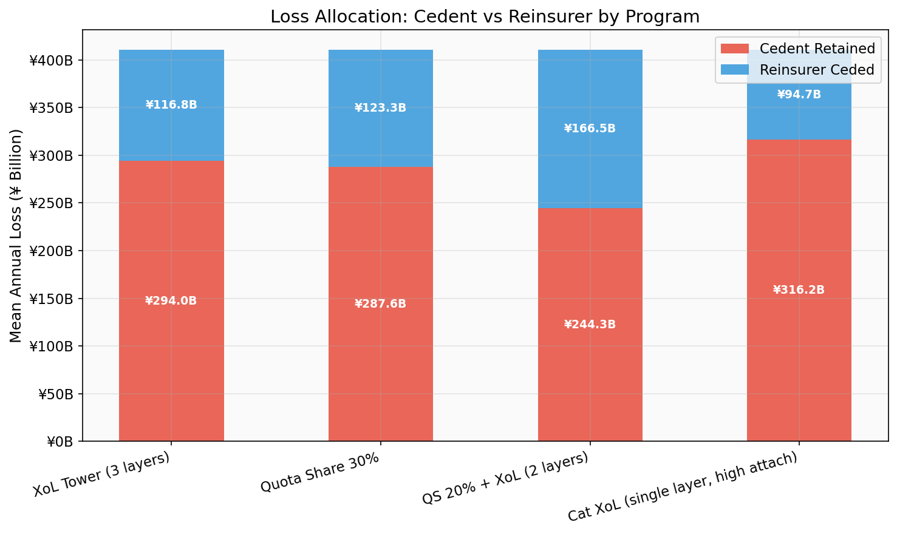
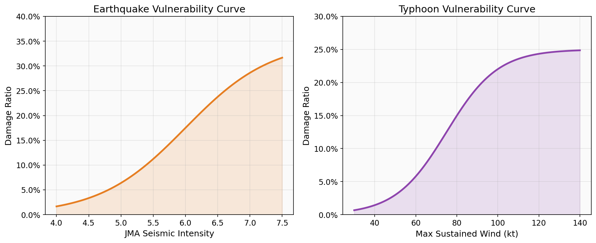

# Japan NatCat Reinsurance Simulator

A Python-based catastrophe reinsurance simulation engine that models earthquake and typhoon losses using real JMA (Japan Meteorological Agency) data, then compares Excess of Loss, Quota Share, and blended reinsurance structures for a hypothetical Japanese property portfolio.

Built as self-directed research into how reinsurance brokers structure, price, and advise on catastrophe risk transfer for Japanese cedents.

---

## Architecture

```
JMA Earthquake Catalog (1923–2025, 47 events)
                                                ┌─ Program A: XoL Tower (3 layers)
  ├→ Hazard Model ──→ Loss Model ──→ Reinsurance ─→ Pricing ──→ Advisory
                      (Poisson +     (Sigmoid      Structures    Engine     Report
JMA Typhoon Best Track  Lognormal)    Vulnerability)
(1959–2024, 38 storms)      ↑
                        Exposure Portfolio
                        (47 prefectures, ¥1,970.5B TSI)
```

**Pipeline steps:**

1. **Data Ingestion** — Load & clean JMA earthquake/typhoon catalogs from `data/raw/`; falls back to synthetic data if CSV is absent
2. **Hazard Modeling** — Fit Poisson frequency to annual event counts; fit Lognormal (or GPD) to event intensities with KS goodness-of-fit test on log-transformed values
3. **Loss Simulation** — 10,000-year Monte Carlo: for each simulated year, draw Poisson(λ) events, sample intensities from fitted severity distribution, convert to losses via sigmoid vulnerability curves
4. **Reinsurance** — Apply 4 program structures to combined annual loss catalog; multi-layer XoL uses sequential exhaustion (each layer receives net-of-prior-layer loss as input)
5. **Pricing** — EL, ROL, VaR at 99th/99.5th percentiles, TVaR, cost-efficiency metrics
6. **Visualization** — Publication-quality charts (non-interactive Agg backend)
7. **Advisory Report** — Broker-style placement memo ranked by cost-efficiency ratio

---

## Results

### Loss Exceedance Curve
> Gross vs net-of-reinsurance loss at key return periods (1-in-100, 1-in-200)



### Reinsurance Structure Comparison
> Technical premium, VaR reduction, and cost-efficiency across 4 programs



### Loss Allocation: Cedent vs Reinsurer
> Mean annual loss split under each program



### Vulnerability Curves
> Sigmoid damage ratio as a function of JMA seismic intensity / max sustained wind speed



---

## Reinsurance Programs

| Program | Structure | Layers |
|---------|-----------|--------|
| **A** | XoL Tower | ¥20B xs ¥10B / ¥50B xs ¥30B / ¥120B xs ¥80B |
| **B** | Quota Share | 30% proportional cession |
| **C** | Blended | 20% QS first, then ¥35B xs ¥15B + ¥100B xs ¥50B (on net-after-QS) |
| **D** | Cat XoL | Single high-attach layer: ¥150B xs ¥50B |

---

## Quick Start

```bash
git clone https://github.com/EdisonLee9111/japan-natcat-reinsurance-simulator.git
cd japan-natcat-reinsurance-simulator

pip install -r requirements.txt

# Run the full 7-step pipeline (seed set in config.yaml under simulation.random_seed)
python run_demo.py

# Use a custom config file
python run_demo.py --config config.yaml

# Run unit tests (23 tests)
pytest tests/ -v
```

> **Note on random seed**: the `--seed` flag does not exist. Set `simulation.random_seed` in `config.yaml` to control reproducibility.

---

## Project Structure

```
japan-natcat-reinsurance-simulator/
│
├── README.md                              # This file
├── config.yaml                            # All tunable parameters
├── run_demo.py                            # End-to-end pipeline (7 steps)
├── requirements.txt                       # numpy, scipy, pandas, matplotlib, ...
├── .gitignore
│
├── src/                                   # Core modules
│   ├── __init__.py
│   ├── data_ingestion.py                  # Module 1: JMA data loading & synthetic fallback
│   ├── hazard_model.py                    # Module 2: Poisson + Lognormal/GPD fitting
│   ├── loss_model.py                      # Module 3: Sigmoid vulnerability & loss generation
│   ├── reinsurance_structures.py          # Module 4: XoL, QS, sequential program stacking
│   ├── pricing_engine.py                  # Module 5: EL, ROL, VaR, TVaR, advisory memo
│   └── visualization.py                   # Module 6: Charts (matplotlib/seaborn, Agg backend)
│
├── data/
│   ├── raw/
│   │   ├── jma_earthquake_history.csv     # 47 major earthquakes (1923–2025, M≥5.0)
│   │   └── jma_typhoon_history.csv        # 38 significant typhoons (1959–2024)
│   ├── processed/                         # Generated loss catalogs (gitignored)
│   └── reference/
│       └── japan_property_exposure.csv    # 47-prefecture exposure portfolio (¥1,970.5B TSI)
│
├── outputs/
│   ├── figures/                           # Generated charts (committed to repo)
│   │   ├── loss_exceedance_curve.png
│   │   ├── structure_comparison.png
│   │   ├── layer_loss_allocation.png
│   │   └── vulnerability_curves.png
│   └── reports/
│       └── sample_placement_summary.md    # Broker advisory report (pipeline-generated)
│
├── tests/
│   └── test_reinsurance_structures.py     # 23 unit tests (XoL, QS, stacking, edge cases)
│
└── docs/                                  # Archived earlier workbook version
    ├── README_Workbook_Version.md
    └── Japan_NatCat_Reinsurance_Workbook.CSV
```

---

## Data Sources

| Data | Source | Coverage |
|------|--------|----------|
| Earthquakes | JMA Seismic Intensity Database | M≥5.0, JMA intensity ≥5-lower, 1923–2025 |
| Typhoons | RSMC Tokyo Best Track | Max wind ≥50 kt or pressure ≤980 hPa, 1959–2024 |
| Exposure | Hypothetical, weighted by Cabinet Office prefectural GDP and Statistics Bureau Housing Survey | 47 prefectures |

---

## Methodology

1. **Frequency**: `annual_count` series built from event catalog years → Poisson(λ) where λ = mean annual count; dispersion ratio (variance/mean) logged for overdispersion check
2. **Severity**: Lognormal fit via log-transformation + Normal MLE; KS test performed on log-values against Normal(μ, σ). GPD alternative available (`severity_distribution: gpd` in config)
3. **Simulation**: Each year draws `n_events ~ Poisson(λ)`, then `intensity ~ Lognormal(μ, σ)` per event; the same `random_seed` in config reproduces results
4. **Vulnerability**: `damage_ratio = cap / (1 + exp(-k·(intensity - x₀)))` — separate sigmoid calibrated for earthquake (JMA intensity) and typhoon (wind speed in kt); loss = damage_ratio × portfolio TSI × stochastic variation (±30%)
5. **Reinsurance stacking**: QS applied first (reduces gross to net-after-QS); subsequent XoL layers each receive the running net loss as input, not the original gross. `gross = net + Σ(ceded per layer)`
6. **Pricing**: `Technical Premium = EL × loading_factor × (1 + expense_ratio)` — defaults 1.35 and 0.05 from config; `ROL = EL / program_limit`; `Cost-Efficiency = Technical Premium / VaR₉₉ reduction`

---

## Configuration

All parameters are in `config.yaml`. Key sections:

| Section | Key Parameters |
|---------|---------------|
| `hazard` | `earthquake_min_magnitude`, `typhoon_min_wind_kt`, `severity_distribution` |
| `loss` | `earthquake_vulnerability` (k, x0, cap), `typhoon_vulnerability` (k, x0, cap) |
| `simulation` | `n_years` (default 10,000), `random_seed` |
| `reinsurance.programs` | Layer type (`xol`/`qs`), attachment, limit, cession_pct for each program |
| `pricing` | `loading_factor`, `expense_ratio`, `profit_margin` |

Change any value and re-run `python run_demo.py` to regenerate all outputs.

---

## Known Limitations

- **No spatial attenuation**: Loss model applies a uniform damage ratio to all 47 prefectures for each event. A production model would attenuate intensity by distance from epicenter (earthquake) or track distance (typhoon), producing prefecture-level loss differentiation.

- **Very small calibration sample**: Only 47 earthquake events and 38 typhoon events are used to fit the severity distributions. With samples this small, the fitted Lognormal parameters are highly uncertain, and KS test p-values may overstate goodness-of-fit. Simulated tail losses (1-in-200 year) should be treated as illustrative, not actuarially credible.

- **Truncated catalog selection bias**: The catalog includes only M≥5.0 / significant-wind events. This is a high threshold — Japan experiences ~1,500 M≥5 earthquakes per year; this 47-event dataset represents only extreme events over 100 years, so the raw λ is artificially low and per-event severity is biased high. Mean Annual Loss (~20% of TSI) is approximately 20× the ~1% typical in production cat models.

- **Simplified vulnerability curves**: Sigmoid curves use a single k/x₀/cap per peril rather than per-occupancy-class curves calibrated to structural engineering data. Not suitable for pricing actual policies.

- **Sequential XoL stacking convention**: The code stacks layers sequentially on running net loss (each layer attaches on net-of-previous), which is one convention. Some market structures attach all XoL layers to the same gross loss simultaneously; results will differ.

- **No correlation between perils**: Earthquake and typhoon annual losses are combined by simple addition with independent random seeds. In reality, co-occurring events in the same year are possible (e.g., a major earthquake year also having active typhoon season), but this correlation is not modeled.

> **Disclaimer**: This is a personal research project. Exposure data is hypothetical. Loss estimates are approximate. Not intended for commercial underwriting or placement decisions.

---

## Related Projects

- [Global LNG Arbitrage Monitor](https://github.com/EdisonLee9111/Global-LNG-Arbitrage-Monitor) — Cross-market energy price spread analysis
- [LNG Market Topology](https://github.com/EdisonLee9111/LNG-Market-Topology) — Constraint-based counterparty behavior inference

---

## License

MIT

---

## Author

**Zhengchao (Edison) Li**
M.S., Institute of Science Tokyo — Mathematical Linguistics
[llee92063@gmail.com](mailto:llee92063@gmail.com)
